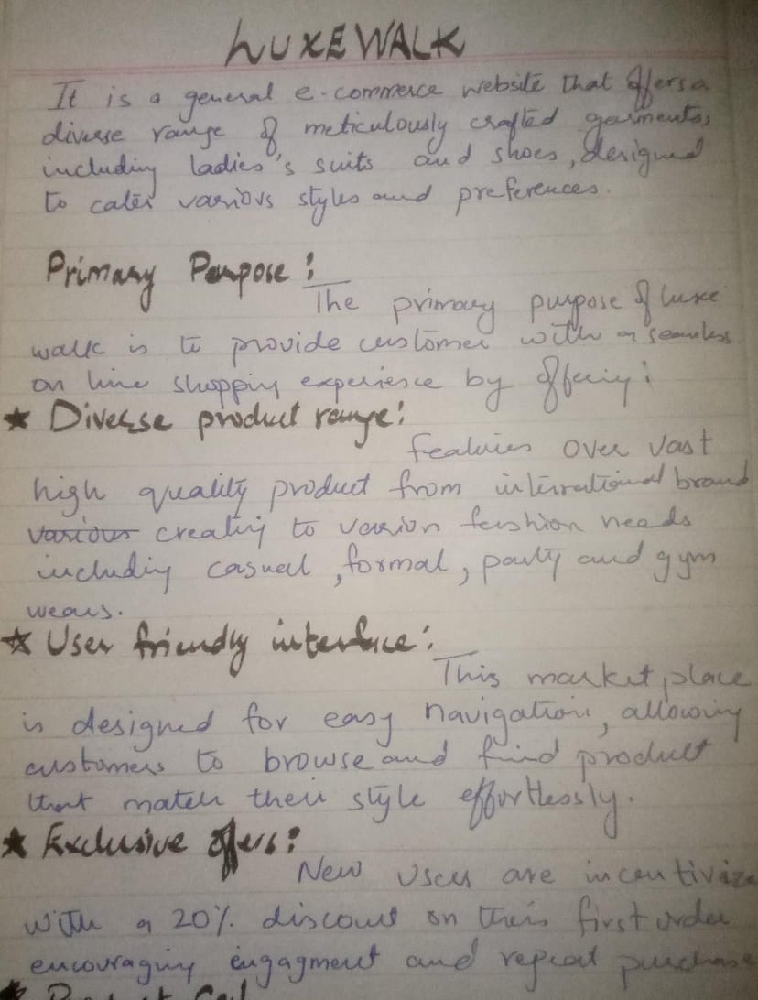
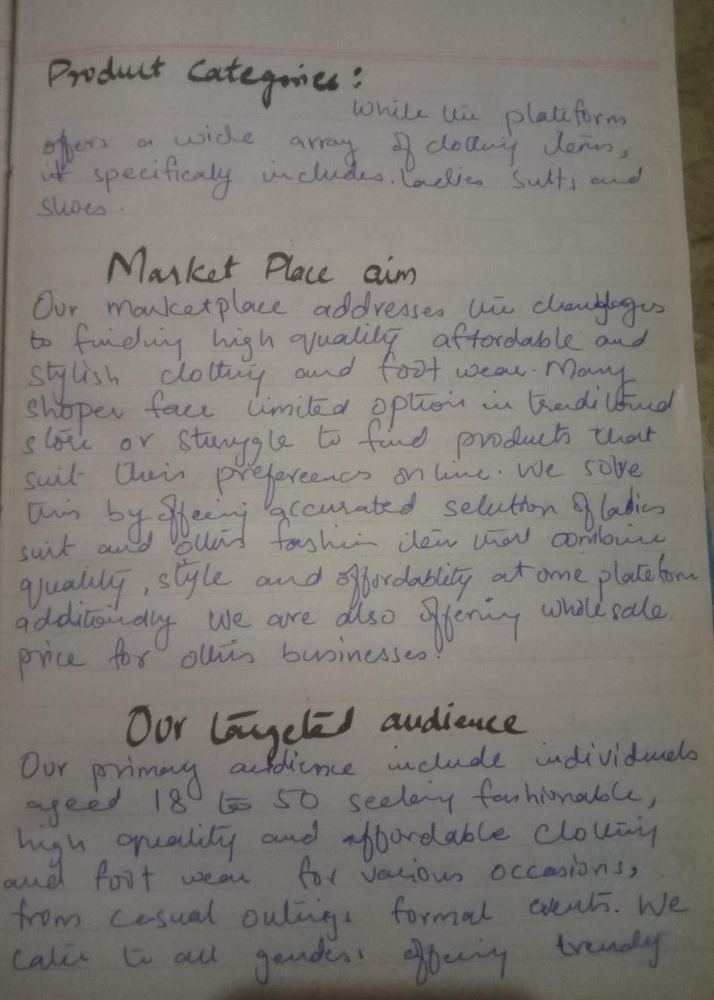
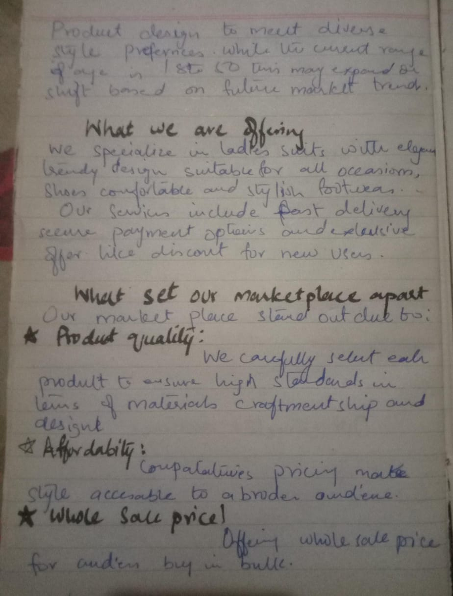
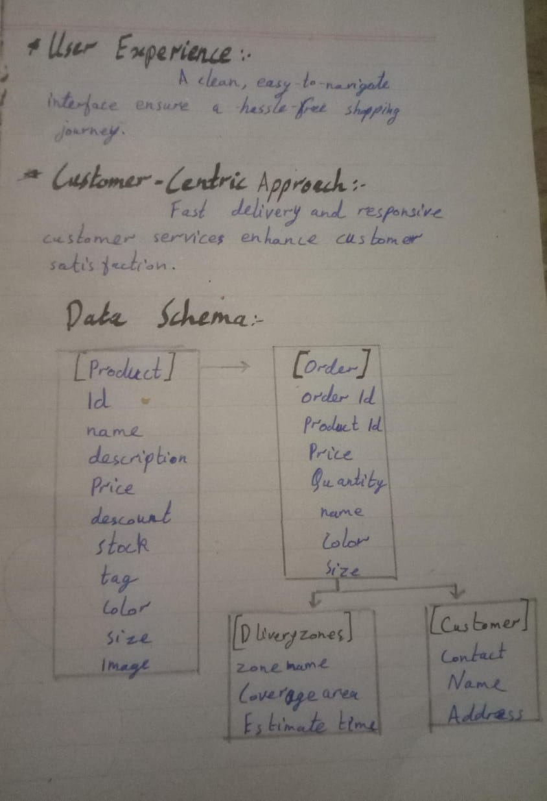

# LUXEWALK

LUXEWALK is a general e-commerce website that offers a diverse range of meticulously crafted garments, including ladies' suits and shoes, designed to cater to various styles and preferences.

## Primary Purpose
The primary purpose of LUXEWALK is to provide customers with a seamless online shopping experience by offering:

### Diverse Product Range
- Featuring over 2,000 high-quality products from more than 200 international brands.
- Catering to various fashion needs, including casual, formal, party, and gym wear.

### User-Friendly Interface
- The website is designed for easy navigation, allowing customers to browse and find products that match their style effortlessly.

### Exclusive Offers
- New users are incentivized with a 20% discount on their first order upon signing up, encouraging engagement and repeat purchases.

## Product Categories
While the platform offers a wide array of clothing items, it specifically includes:
- **Ladies' Suits**: A selection of suits tailored for women, suitable for various occasions.
- **Shoes**: Footwear options that complement different outfits and styles.

## Marketplace Goals

### 1. What problem does your marketplace aim to solve?
Our marketplace addresses the challenges of finding high-quality, affordable, and stylish clothing and footwear. Many shoppers face limited options in traditional stores or struggle to find products that suit their preferences online. We solve this by offering a curated selection of fashion items that combine quality, style, and affordability. Additionally, we make shopping convenient with a seamless online experience.

### 2. Who is your target audience?
Our primary audience includes individuals aged 18 to 50 seeking fashionable, high-quality, and affordable clothing and footwear for various occasions, from casual outings to formal events. We cater to all genders, offering trendy products designed to meet diverse style preferences. Additionally, we serve gift shoppers and those who appreciate a user-friendly online shopping experience. While the current age range is 18-50, this may expand or shift based on future market trends.

### 3. What products or services will you offer?
We specialize in:
- **Ladies’ Suits**: Elegant, trendy designs suitable for formal, casual, or festive occasions.
- **Shoes**: Comfortable and stylish footwear.

**Services include:**
- Fast delivery
- Secure payment options
- Exclusive promotions like discounts for new users

### 4. What will set your marketplace apart?
Our marketplace stands out due to:
- **Product Quality**: We carefully select each product to ensure it meets high standards in terms of materials, craftsmanship, and design.
- **Affordability**: Competitive pricing makes style accessible to a broader audience.
- **Wholesale Pricing**: Offering wholesale prices for customers who buy in bulk.
- **User Experience**: A clean, easy-to-navigate interface ensures a hassle-free shopping journey.
- **Customer-Centric Approach**: Fast delivery and responsive customer service enhance customer satisfaction.

---

## Data Schema

### **[Product]**
```json
{
    "_id": "string",
    "slug": "string",
    "name": "string",
    "description": "string",
    "price": "number",
    "priceWithoutDiscount": "number",
    "discountPercentage": "number",
    "rating": "number",
    "stockLevel": "number",
    "tags": ["string"],
    "sizes": ["string"],
    "colors": ["string"],
    "images": ["url"],
    "reviews": [
        {
            "name": "string",
            "review": "string",
            "rating": "number",
            "date": "string"
        }
    ]
}
```

### **[Order]**
```json
{
    "orderId": "string",
    "productPrice": "number",
    "quantity": "number",
    "name": "string",
    "price": "number",
    "color": "string",
    "size": "string"
}
```

### **[Customer]**
```json
{
    "customerId": "string",
    "contact": "string",
    "name": "string",
    "address": "string",
    "orderId": "string"
}
```

### **[Delivery Zones]**
```json
{
    "zoneName": "string",
    "coverageArea": "string",
    "estimatedTime": "string"
}
```

 
 
 
 